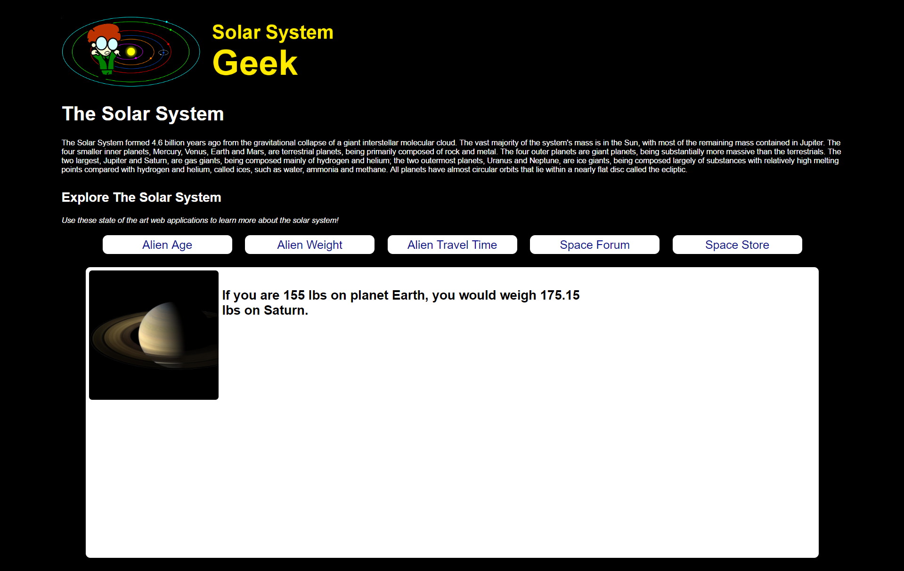
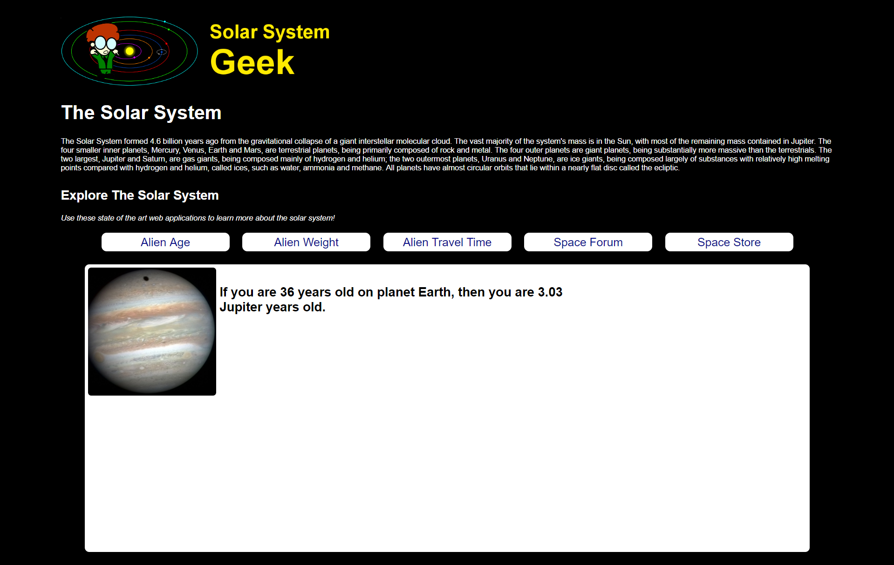
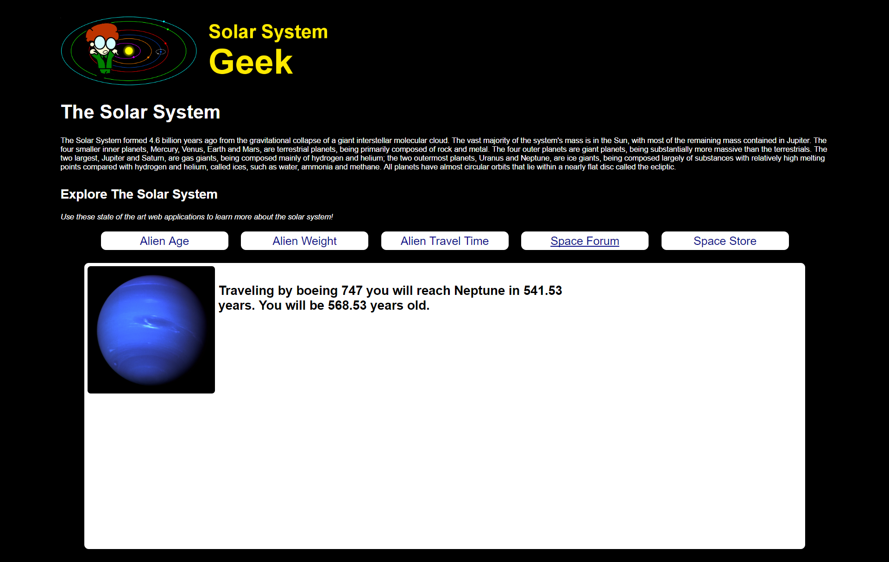
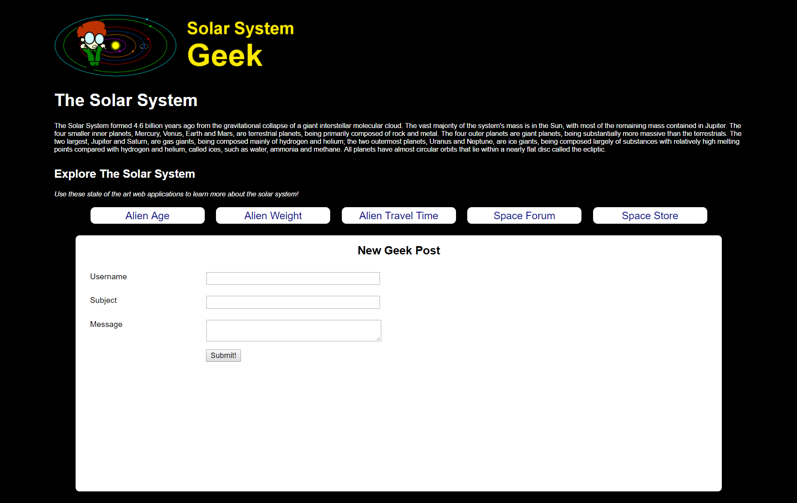
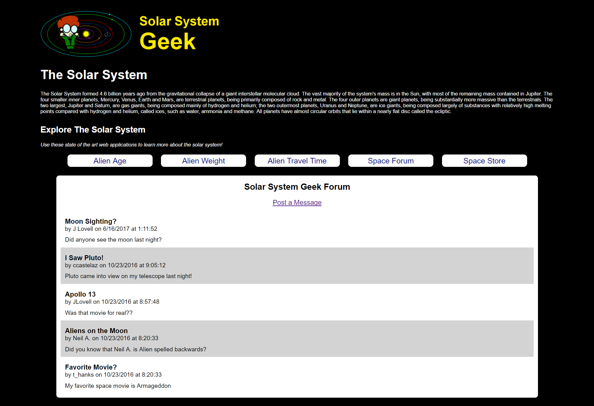
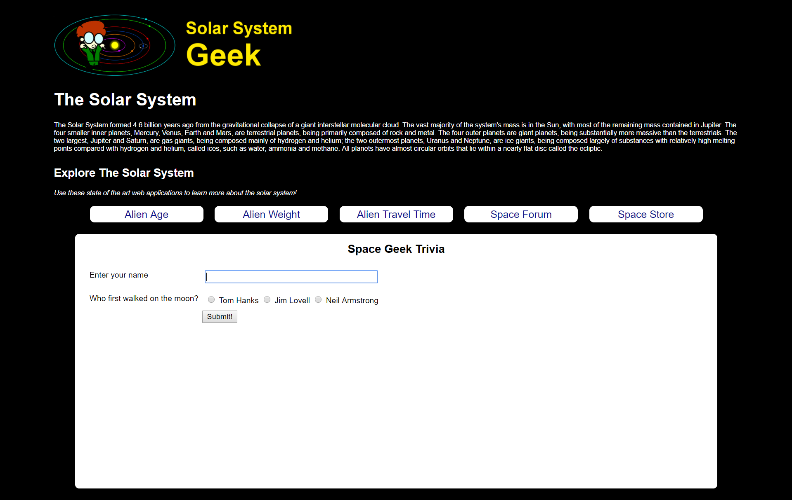
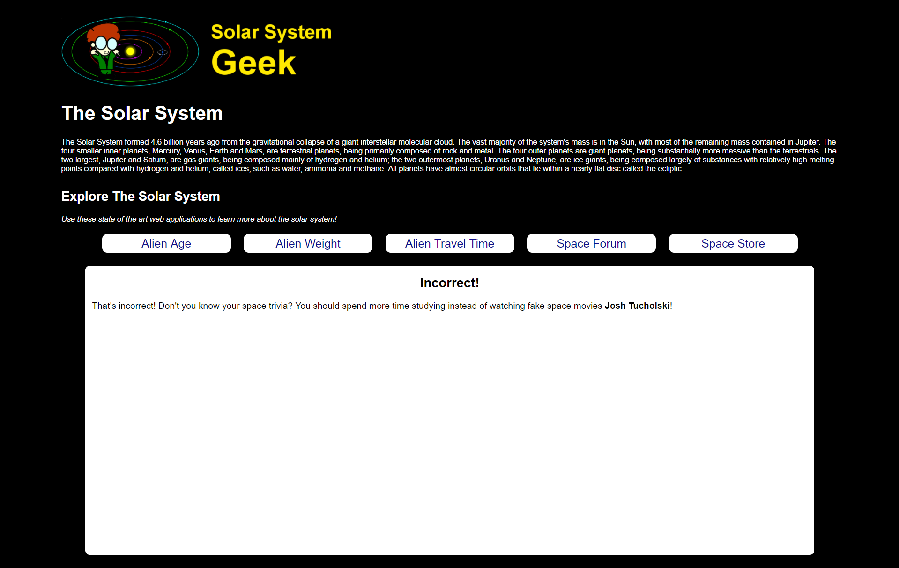
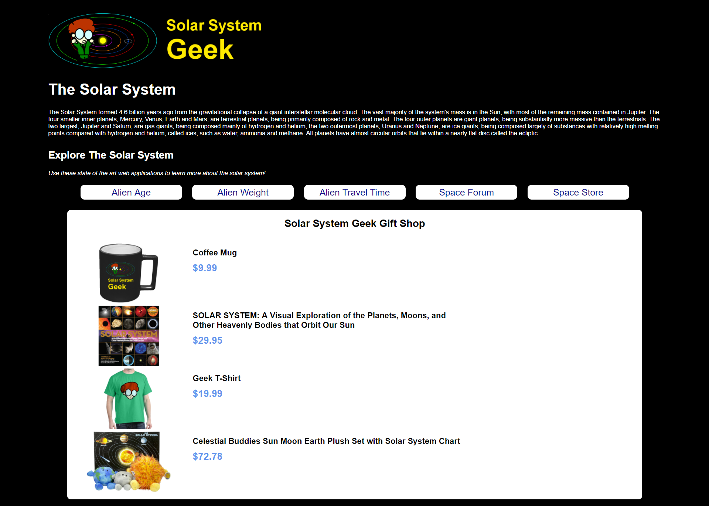
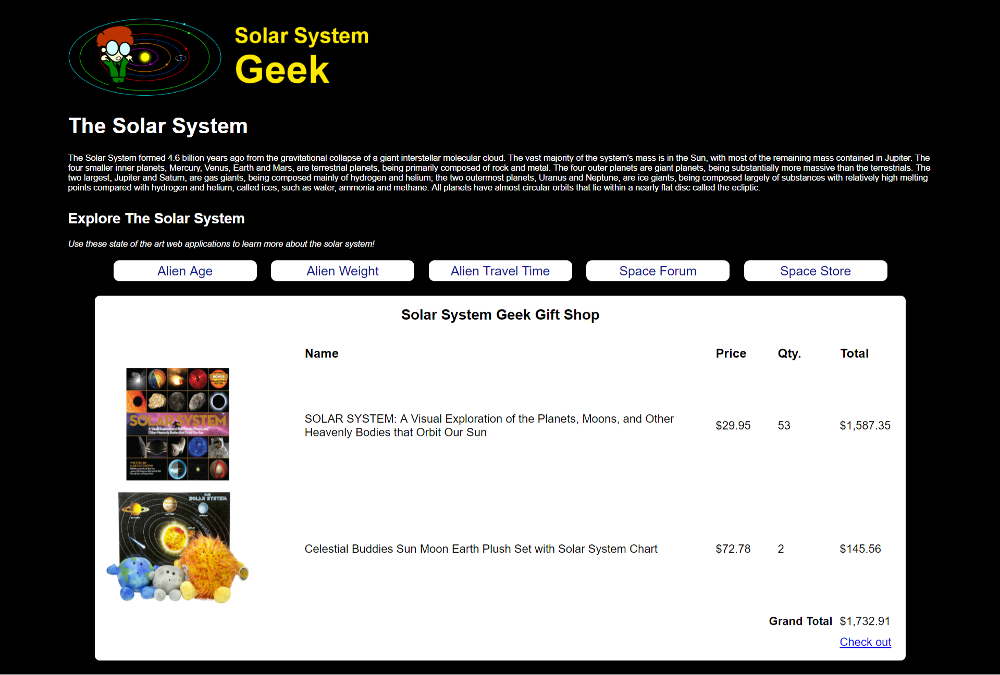
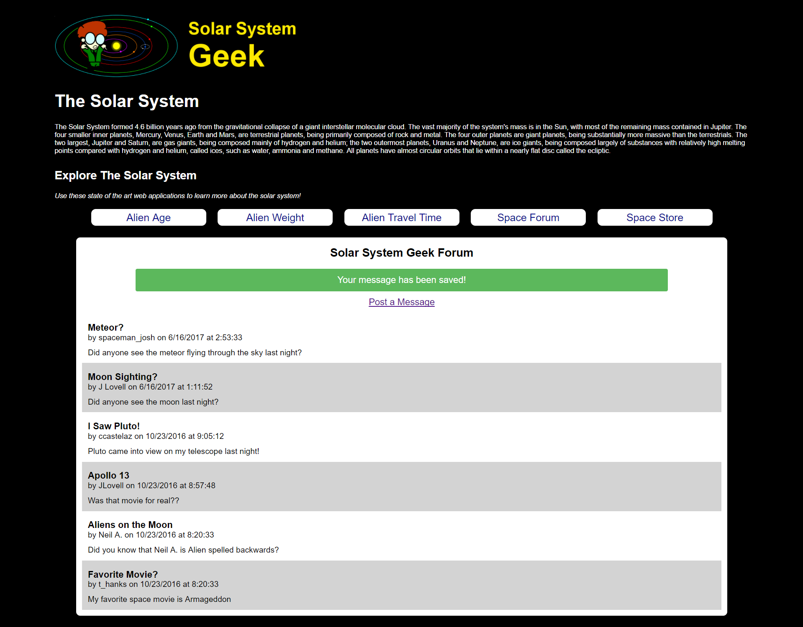

# Day 1 - HTTP GET

On the Solar System Geek home page, there are links for three different calculation tools to "Explore the Solar System." Implement these calculators as specified below and modify the home page links to point to your implementations.

## Alien Weight Calculator
Given a weight on Earth, this calculator computes the equivalent weight on another planet in the solar system.  Use the [gravity of the alien planet](http://www.aerospaceweb.org/question/astronomy/q0227.shtml) compared to Earth's gravity to calculate the alien weight.

### **Input**

### **Output**

## Alien Age Calculator
Given an age in Earth years, this calculator computes the equivalent age in [years for another planet in the solar system](http://www.enchantedlearning.com/subjects/astronomy/age.shtml).

### **Input**

### **Output**

## Alien Travel Calculator
Given a destination planet, mode of transportation, and age of the traveler at the start of the journey, this calculator computes the total travel time and age of the traveler upon arrival. The calculation should be based on the [average distance between planets in the solar system](http://theplanets.org/distances-between-planets/) and the following table of modes of transportation and their speeds:

| Mode of Transport | Speed   |
| ----------------- | ------- | 
| Walking				| 3mph    | 
| Car					| 100mph  | 
| Bullet Train		| 200mph  | 
| Boeing 747			| 570mph  | 
| Concorde			| 1350mph | 

### **Input**

### **Output**

# Day 2 - HTTP POST

You're developing an online bulletin board web component for SSGeek. It is a general forum posting, so anyone is welcome to join and post without needing to log in.

The feature has two requirements:
1. Provide a page that allows a site user to submit a new post to the bulletin board.
2. Provide a page to view all posts on the bulletin board.

A database script(`scripts/ssgeek.sql`), an interface (`IForumPostDAL`), and a data access class for you to implement has been provided.

## Submitting a New Post

Users can navigate to a page on the web application that provides them with a form to submit a new post for a bulletin board.

The page provides the user with the form to submit:

* Username
* Subject
* Message

## Viewing a Post

The View Posts page allows users the ability to see any posts that were previously submitted to the web application.

The page should display all of the prior posts to the user. You can use any type of layout that you prefer. 

## BONUS

Create a form that allows website visitors to sign up to win a prize.

Each visitor needs to provide their name, and answer a space trivia question.

Leverage HTTP POST and the Post-Redirect-Get pattern to
1. Show the user the form
2. Have the user post their answer
3. Redirect the user to the correct action based on the input

Based on the user's answer, they see a Correct or Incorrect page letting them know the outcome.

# Day 3 - SESSION

You'll create a shopping cart that allows your website visitor the ability to view products, select a product, and add it to their shopping cart.

## Product List Page

The product listing page displays all of the inventory that the SSGeek shop contains. Product data is available in `scripts/ssgeek-orders.sql`.

**Requirements**

- When the user clicks on the image of a product, they are navigated to the **Product Detail** page.
- Use the URL pattern `/ShoppingCart/Index`. 

## Product Detail Page

The product detail page displays the data for a specific product and allows users to add products to their shopping cart.

**Requirements**

- When the user enters a quantity into the textbox and *presses Enter* or *presses Add to Cart*, the product is added to their shopping cart.
- After the user adds an item to their shopping cart, they are redirected to the View Cart page.
- Use the URL pattern `/ShoppingCart/Detail/{product-id}`.

## View Shopping Cart

The View Shopping Cart page displays all of the items that are in the visitor's shopping cart to purchase.

**Requirements**

- Use the URL pattern `/ShoppingCart/ViewCart`.

## Temporary Redirect Data

You'll work on the Forum Post page that you created on day two to display a confirmation message when the user posts a new forum message.

**Requirements**

- When the user visits the `Forum/` page, display a list of the existing forum posts.
- Immediately after the user submits a new Forum post from the `Forum/New` page, display the list of existing forum posts with a success message at the top.

# Day 4 - Validation and Error Handling

Add error handling to the Forum Post page to the **New Post** page that ensures a post meets the following criteria:

* Username is required
* Username cannot exceed 20 characters
* Subject is required
* Subject is a minimum of 2 characters
* Message is required

# Day 5 - Dependency Injection

Go back to each of your days that access a database (Forum and Space Store) and apply dependency injection to the controllers so that the controllers do not instantiate their own data access layer objects.